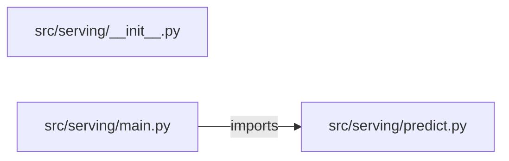

# ml-model-serving-api — project architecture

[README](README.md) · [Interview questions and answers](INTERVIEW_QA.md)

## Purpose and scope

Load `models/house-price-v1.json` and score square feet and bedrooms. A missing feature is rejected. The endpoint does not retrain.

This document describes files and symbols in this checkout. Deployment templates and statements in the original overview are distinguished from a verified running environment.

## Component diagram



For Python repositories, arrows show resolved local imports, not network calls or deployment order. Otherwise the diagram is a repository component map; containment arrows do not assert runtime integration.

## Components and responsibilities

| Component | Responsibility |
| --- | --- |
| [`src/serving/main.py`](src/serving/main.py) | HTTP handlers: `POST /predict` |
| [`src/serving/predict.py`](src/serving/predict.py) | Functions: `predict` |
| [`requirements.txt`](requirements.txt) | Implementation or supporting configuration |
| [`src/serving/__init__.py`](src/serving/__init__.py) | Implementation or supporting configuration |
| [`tests/test_serving.py`](tests/test_serving.py) | Executable checks and regression examples |
| [`.github/workflows/ci.yml`](.github/workflows/ci.yml) | GitHub Actions job definitions |
| [`README.md`](README.md) | Project explanations or operating notes |

## Request interface

| Method and path | Handler | Source |
| --- | --- | --- |
| `POST /predict` | `post_predict` | [`src/serving/main.py`](src/serving/main.py#L7) |

The table lists literal route decorators found in the inspected Python modules. Router prefixes and middleware can add behavior; check the linked handler and application setup before calling an endpoint.

## Implementation walkthrough

### `predict(features)`

Source: [`src/serving/predict.py`](src/serving/predict.py#L6).

Calls visible in this function: `sum`.

```python
def predict(features):
    missing = [name for name in MODEL["weights"] if name not in features]
    if missing:
        return None
    price = sum(MODEL["weights"][name] * features[name] for name in MODEL["weights"])
    return {"price": price, "model": MODEL["name"], "version": MODEL["version"]}
```

## Validation and failure paths

| Explicit exception | Source |
| --- | --- |
| `HTTPException(status_code=422, detail='sqft and bedrooms are required.')` | [`src/serving/main.py`](src/serving/main.py#L10) |

These are explicit exceptions in the inspected source, rather than a claim that every failure is handled. Follow the calling handler to see whether the exception becomes an HTTP response or propagates.

## Data flow and design decisions

### What is the input-to-output contract of `predict`

In [`src/serving/predict.py`](src/serving/predict.py#L6), `predict(features)` receives the inputs. The function computes these intermediate values:

- `missing = [name for name in MODEL['weights'] if name not in features]`
- `price = sum((MODEL['weights'][name] * features[name] for name in MODEL['weights']))`

Its result is defined by:

- `{'price': price, 'model': MODEL['name'], 'version': MODEL['version']}`
- `None`

### Which decision rules or boundary conditions should an interviewer challenge

The implementation in [`src/serving/predict.py`](src/serving/predict.py#L6) branches on:

- `missing`

A useful extension is a table-driven test that covers each condition just below, at, and above its boundary where applicable. These expressions are the current rules; changing them changes behavior and should be justified by the project’s acceptance criteria.

## Setup and verification

The following commands are derived from the checked-in dependency/test contracts. Execute them from the repository root; the block prepares a local environment, not a cloud deployment.

```bash
python3 -m venv .venv
source .venv/bin/activate
python -m pip install -r requirements.txt
python -m pytest -q
```

Python dependencies: [`requirements.txt`](requirements.txt).

Test entry points: [`tests/test_serving.py`](tests/test_serving.py).

Automation definitions: [`.github/workflows/ci.yml`](.github/workflows/ci.yml). Read their triggers and job steps to determine what CI actually runs.

## Operating boundaries and design review

Before turning this checkout into a customer deployment, establish the input contract, data ownership, access controls, failure response, evaluation criteria, and rollback owner. Repository fixtures and unit tests demonstrate local behavior; they do not establish throughput, uptime, compliance, or business impact.

A useful architecture review starts with the linked implementation: identify where input enters, where a decision is made, which state can change, and which external dependency can fail. Add a deployment view only for infrastructure that is actually configured and exercised.
